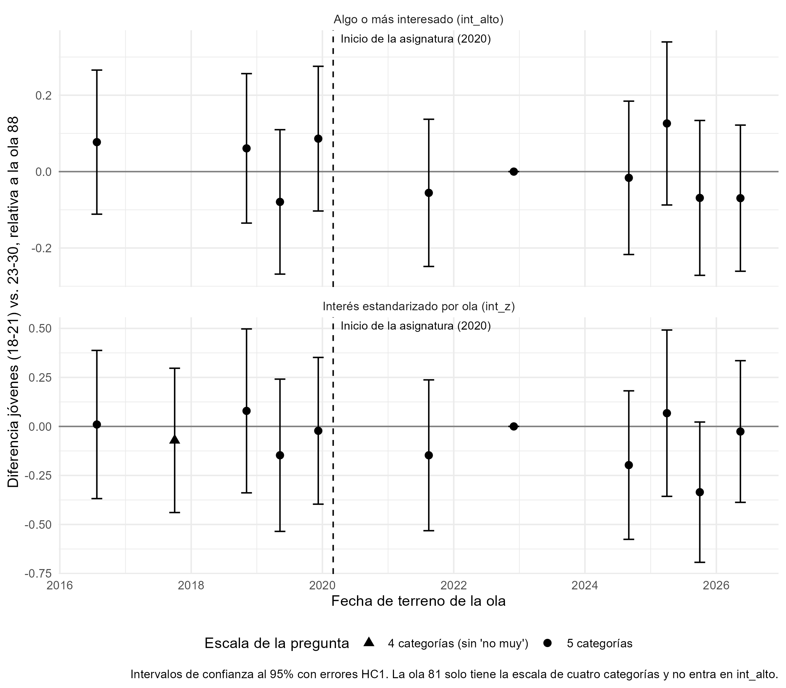

```{r}
#| label: setup
#| echo: false

pacman::p_load(dplyr, gtsummary, texreg, lmtest, sandwich)

res_int <- readRDS("output/models/modelos_interes.rds")
res_comb <- readRDS("output/models/modelos_interes_combinaciones.rds")
res_voto <- readRDS("output/models/modelos_voto.rds")
res_did <- readRDS("output/models/modelos_did_interes.rds")
res_esc <- readRDS("output/models/did_interes.rds")
res_ext <- readRDS("output/models/did_ext.rds")
res_pond <- readRDS("output/models/modelos_ponderados.rds")

# Nombres legibles para los coeficientes de las tablas de regresión
renombrar <- function(m) {
  tr <- texreg::extract(m)
  nombres <- tr@coef.names
  nombres <- sub("(Intercept)", "Intercepto", nombres, fixed = TRUE)
  nombres <- gsub("educacion_ciudadana", "Educación ciudadana", nombres, fixed = TRUE)
  nombres <- gsub("edad_nac", "Edad", nombres, fixed = TRUE)
  nombres <- gsub("educ(?=\\p{Lu})", "", nombres, perl = TRUE)
  nombres <- sub("^joven:post$", "Joven (18 a 21 años) × período posterior", nombres)
  nombres <- sub("^joven$", "Joven (18 a 21 años)", nombres)
  nombres <- gsub(":", " × ", nombres, fixed = TRUE)
  tr@coef.names <- nombres
  tr
}

# Formato de números en el texto: coma decimal y sin "-0,00"
num <- function(x, d = 2) formatC(round(x, d) + 0, format = "f", digits = d, decimal.mark = ",")
num_p <- function(p) if (p > 0.99) "> 0,99" else if (p < 0.001) "< 0,001" else paste("=", num(p, 3))
entero <- function(x) format(x, big.mark = ".", decimal.mark = ",")
olas <- function(d) paste(levels(droplevels(d$ola)), collapse = ", ")

# Coeficiente con error estándar HC1
w_hc1 <- function(m, v) lmtest::coeftest(m, vcov. = sandwich::vcovHC, type = "HC1")[v, ]
```

```{r}
#| label: estimaciones-principales
#| echo: false

## Estimaciones principales del efecto sobre el interés político --------------
reg3 <- w_hc1(res_int$modelos[[3]], "educacion_ciudadana")
did2x2 <- w_hc1(res_did$modelos[[2]], "joven:post")
didtw <- w_hc1(res_did$modelos[[3]], "educacion_ciudadana")
m1_esc <- w_hc1(res_esc$modelos$m1_lin, "W")
att_esc <- res_esc$resumen$att_m2
comp_ext <- res_ext$comparacion
m1_ext <- comp_ext[3, ]
m1_85alto <- comp_ext[2, ]
equiv <- res_esc$resumen$equivalencia_w
adel_esc <- res_esc$resumen$pruebas_adelantos
previas <- res_ext$pruebas_previas
errores_w <- res_esc$resumen$errores_w

tabla_principal <- data.frame(
  Diseño = c("Regresión transversal (edad y educación como controles)",
             "Diferencia en diferencias 2x2 con EF de edad",
             "EF de edad y ola con tratamiento individual",
             "Diferencia en diferencias escalonada, M1",
             "Diferencia en diferencias escalonada, M2 (ATT)",
             "Escalonada con olas 77 a 96, M1"),
  Resultado = c(rep("Interés (1 a 5)", 5), "Algo o más interesado (proporción)"),
  Olas = c("85 a 96", "85, 92 a 96", "85 a 96", "85 a 96", "85 a 96", "77 a 96"),
  n = c(nobs(res_int$modelos[[3]]), nobs(res_did$modelos[[2]]), nobs(res_did$modelos[[3]]),
        nobs(res_esc$modelos$m1_lin), nobs(res_esc$modelos$m2_lin), m1_ext$n),
  Estimación = c(reg3[1], did2x2[1], didtw[1], m1_esc[1], att_esc$estimacion, m1_ext$estimacion),
  EE = c(reg3[2], did2x2[2], didtw[2], m1_esc[2], att_esc$ee, m1_ext$ee_hc1),
  p = c(reg3[4], did2x2[4], didtw[4], m1_esc[4], att_esc$p, m1_ext$p_hc1)
) %>%
  dplyr::mutate(`IC 95%` = sprintf("[%s; %s]", num(Estimación - 1.96 * EE), num(Estimación + 1.96 * EE)))
```

# Resultados principales

Este proyecto evalúa si la asignatura de Educación Ciudadana, que se imparte en 3° y 4° medio desde 2020, se asocia con el interés político y la participación electoral de las cohortes que la cursaron, usando las olas 77 a 96 de la Encuesta CEP. Los principales resultados son los siguientes:

- **Asociación sin controles.** Quienes cursaron la asignatura declaran más interés político que el resto de la muestra, pero esa diferencia se explica por su edad: al comparar dentro de cada ola y controlar por edad, el coeficiente es `r num(reg3[1])` (EE = `r num(reg3[2])`; p `r num_p(reg3[4])`).
- **Diferencia en diferencias.** Ningún diseño de diferencia en diferencias muestra un efecto de la asignatura sobre el interés político. En el diseño escalonado principal el efecto es `r num(m1_esc[1])` puntos en una escala de 1 a 5 (EE = `r num(m1_esc[2])`; p `r num_p(m1_esc[4])`), y el resultado se mantiene con errores agrupados por celda de edad y ola y con un *wild cluster bootstrap* por cohorte (p `r num_p(errores_w$p[3])`).
- **Tendencias previas.** Al agregar las olas 77 a 84, levantadas antes de la asignatura, las diferencias entre jóvenes y adultos jóvenes son estables antes de 2020 (prueba conjunta: p `r num_p(previas$p[1])`), y el efecto estimado es `r num(m1_ext$estimacion)` en la probabilidad de estar algo o más interesado (EE = `r num(m1_ext$ee_hc1)`; p `r num_p(m1_ext$p_hc1)`). Las olas previas reducen el error estándar en `r num(-100 * m1_ext$cambio_ee_hc1, 0)`%.
- **Magnitud.** La prueba de equivalencia no permite afirmar que el efecto sea menor que 0,2 desviaciones estándar (p `r num_p(equiv$p_equivalencia)`): el intervalo de confianza al 90% va de `r num(equiv$ic90_inf)` a `r num(equiv$ic90_sup)` puntos. Los datos descartan efectos negativos de esa magnitud, pero no efectos positivos de hasta `r num(equiv$ic90_sup)` puntos.
- **Robustez.** Ninguna variante muestra un efecto positivo y significativo una vez considerada la edad: usar el grupo socioeconómico en lugar de la educación, restringir la muestra a jóvenes, excluir los casos con fecha de nacimiento imputada, ponderar o considerar el diseño muestral. La única estimación significativa con edad como control es negativa, en la regresión con grupo socioeconómico.
- **Voto.** Quienes cursaron la asignatura votaron menos en la 2ª vuelta de 2021. Esos modelos solo controlan por edad, educación y ola, y quienes cursaron la asignatura eran los votantes más jóvenes, por lo que la diferencia no puede interpretarse como un efecto de la asignatura.

```{r}
#| label: tabla-principal
#| echo: false

tabla_principal %>%
  dplyr::mutate(n = entero(n)) %>%
  dplyr::select(Diseño, Resultado, Olas, n, Estimación, EE, `IC 95%`, p) %>%
  knitr::kable(digits = 3, format.args = list(decimal.mark = ","),
               caption = "Estimaciones del efecto de la asignatura de Educación Ciudadana sobre el interés político (errores estándar HC1)")
```

El Plan de Formación Ciudadana (Ley 20.911), vigente desde 2016, alcanzó también a parte de las cohortes de comparación. Siguiendo a Callaway, Goodman-Bacon y Sant'Anna ("Difference-in-Differences with a Continuous Treatment"), las estimaciones de diferencia en diferencias corresponden al efecto de la asignatura junto con una mayor exposición al Plan, en comparación con un grupo que tiene exposición positiva al Plan.

# Datos y diseño

El tratamiento (`educacion_ciudadana`) identifica a quienes tuvieron la asignatura según su fecha de nacimiento: nacidos desde el 01-abr-2003, que en edad normativa cursaron 3° medio en 2020 o después. En los análisis de voto, los casos sin fecha de nacimiento quedan fuera de los modelos. En los análisis de interés político, la fecha de nacimiento se imputa desde la edad declarada cuando no está disponible: en toda la CEP 96 (mayo de 2026), que no tiene esa información, y en los casos sin fecha de las demás olas.

La pregunta "¿Cuán interesado está Ud. en la política?" tiene las mismas cinco categorías en las olas 77, 82, 83, 84 y 85 a 96. La ola 81 tiene una versión de cuatro categorías y solo se usa con el interés estandarizado dentro de cada ola. El detalle de la construcción de las bases está en el documento de [preparación](processing/preparation.qmd).

# Interés político

La base principal de interés político reúne las olas CEP `r olas(res_int$datos)`. Las regresiones se estiman sobre los mismos `r entero(nrow(res_int$datos))` casos con información completa. La escala se invirtió para que 1 indique nada interesado y 5 muy interesado.

## Descriptivos

```{r}
#| label: desc-interes
#| echo: false

res_int$datos %>%
  dplyr::select(int_pol, educacion_ciudadana, educ, edad_nac) %>%
  gtsummary::tbl_summary(
    label = list(int_pol ~ "Interés político (1-5)",
                 educacion_ciudadana ~ "Tuvo la asignatura de Educación Ciudadana",
                 educ ~ "Nivel educacional",
                 edad_nac ~ "Edad"),
    type = list(int_pol ~ "continuous",
                educacion_ciudadana ~ "dichotomous"),
    statistic = list(gtsummary::all_continuous() ~ "{mean} ({sd})"),
    missing_text = "Sin dato"
  ) %>%
  gtsummary::modify_header(label ~ "**Variable**") %>%
  gtsummary::modify_caption("Descriptivos, base de interés político")
```

## Regresiones transversales

Modelos lineales para el interés político, todos con efectos fijos de ola: sin otros controles (1), con nivel educacional como control (2) y con nivel educacional y edad como controles (3). Los efectos fijos de ola hacen que la comparación entre quienes cursaron la asignatura y el resto se realice dentro de cada ola. El nivel educacional se agrupa en básica, media, técnica y universitaria o más (nivel más alto cursado, completo o no); la categoría de referencia es "Básica".

```{r}
#| label: reg-interes
#| echo: false
#| results: asis

texreg::htmlreg(
  lapply(res_int$modelos, renombrar),
  custom.model.names = paste("Modelo", seq_along(res_int$modelos)),
  omit.coef = "factor[(]ola[)]",
  custom.gof.rows = list("EF ola" = rep("Sí", length(res_int$modelos))),
  caption = "Asignatura de Educación Ciudadana e interés político",
  caption.above = TRUE,
  custom.note = "%stars. Errores estándar entre paréntesis."
)
```

La tabla siguiente muestra el coeficiente de la asignatura en las mismas tres regresiones bajo todas las combinaciones de tres decisiones de análisis: el control socioeconómico (nivel educacional o grupo socioeconómico en tres grupos), el tratamiento de los casos sin fecha de nacimiento en las olas 85, 92 y 93 (imputarlos desde la edad declarada o excluirlos) y el uso del ponderador de la encuesta. La CEP 96 se incluye en todas las versiones, con su fecha de nacimiento imputada.

```{r}
#| label: tabla-combinaciones
#| echo: false

res_comb$tabla_ancha %>%
  dplyr::rename(Control = control, `Casos sin fecha` = imputacion,
                Ponderación = ponderacion) %>%
  knitr::kable(caption = "Coeficiente de la asignatura sobre el interés político según la especificación")
```

Todos los modelos incluyen efectos fijos de ola. Modelo 1: sin otros controles. Modelo 2: con el control socioeconómico. Modelo 3: con el control socioeconómico y la edad. \* p < 0,05; \*\* p < 0,01; \*\*\* p < 0,001. Errores estándar HC1 entre paréntesis.

```{r}
#| label: interp-combinaciones
#| echo: false

tc <- res_comb$tabla
rango <- function(x) paste(num(min(x)), "y", num(max(x)))
m1c <- tc %>% dplyr::filter(modelo == 1)
m2_gse <- tc %>% dplyr::filter(modelo == 2, control == "Grupo socioeconómico", ponderacion == "Sin ponderar")
m2_educ <- tc %>% dplyr::filter(modelo == 2, control == "Nivel educacional")
m3c <- tc %>% dplyr::filter(modelo == 3)
m3_sig <- m3c %>% dplyr::filter(p < 0.05)
```

Solo con efectos fijos de ola (modelo 1), la asociación entre la asignatura y el interés político es positiva en todas las especificaciones, con coeficientes entre `r rango(m1c$estimacion)`. Al agregar el control socioeconómico (modelo 2), el coeficiente se acerca a cero con el nivel educacional (entre `r rango(m2_educ$estimacion)`) y se mantiene en torno a `r num(mean(m2_gse$estimacion))` con el grupo socioeconómico sin ponderar, porque el nivel educacional absorbe en parte la edad de quienes cursaron la asignatura y el grupo socioeconómico no lo hace. Al controlar además por la edad (modelo 3), los coeficientes quedan entre `r rango(m3c$estimacion)`. `r if (nrow(m3_sig) == 0) "Ninguno es significativo al 5%." else if (nrow(m3_sig) == 1) paste0("Solo 1 de las ", nrow(m3c), " especificaciones es significativa al 5%, con un coeficiente de ", num(m3_sig$estimacion), ".") else paste0("En ", nrow(m3_sig), " de las ", nrow(m3c), " especificaciones el coeficiente es significativo al 5%, con valores entre ", rango(m3_sig$estimacion), ".")` Con ninguna combinación de decisiones de análisis aparece un efecto positivo de la asignatura una vez considerada la edad. Estas regresiones comparan a los tratados con personas de todas las edades, por lo que los diseños de diferencia en diferencias de las secciones siguientes son más adecuados para estimar el efecto.

## Diferencia en diferencias escalonada

Las edades funcionan como grupos y las olas como períodos: la cohorte que cursó la asignatura envejece entre olas, por lo que cada edad pasa a estar tratada en una ola distinta, y las personas de 23 a 30 años no están tratadas en ninguna ola. El diseño sigue a Wooldridge ("Nonlinear Difference-in-Differences with Repeated Cross Sections") y a Deb, Norton, Wooldridge y Zabel (2025). M1 supone un efecto constante del tratamiento (`W`) y M2 permite un efecto distinto por celda tratada; ambos incluyen efectos fijos de edad y de ola. La tabla muestra el efecto parcial promedio de `W` sobre los tratados en versiones lineales y no lineales. El detalle está en el documento de [diferencia en diferencias escalonada](processing/analysis_did_interes.qmd).

```{r}
#| label: tabla-escalonado
#| echo: false

res_esc$resumen$efectos_w %>%
  dplyr::transmute(Modelo = modelo, Estimación = estimacion, EE = ee,
                   `IC 95%` = sprintf("[%s; %s]", num(ic_inf, 3), num(ic_sup, 3)), p) %>%
  knitr::kable(digits = 3, format.args = list(decimal.mark = ","),
               caption = "Efecto de W sobre los tratados, diferencia en diferencias escalonada (errores estándar HC1)")
```

El tratamiento se asigna por celda de edad y ola, por lo que los errores que tratan cada observación como independiente pueden subestimar la incertidumbre. La tabla siguiente muestra el estimador de M1 con errores agrupados.

```{r}
#| label: tabla-errores
#| echo: false

errores_w %>%
  dplyr::transmute(Modelo = modelo, Error = error, Grupos = n_grupos, Estimación = estimacion,
                   EE = ee, p, `IC 95%` = sprintf("[%s; %s]", num(ic_inf, 3), num(ic_sup, 3))) %>%
  knitr::kable(digits = 3, format.args = list(decimal.mark = ","),
               caption = "Estimador de W en M1 con distintos errores estándar")
```

La prueba conjunta de los indicadores de adelanto de las cohortes con más de un período previo no rechaza el supuesto de tendencias paralelas (p `r num_p(adel_esc$p[1])` en la versión lineal). La prueba de equivalencia, con un umbral de ±0,2 desviaciones estándar de `int_pol` (±`r num(equiv$umbral)` puntos), entrega un valor p de `r num(equiv$p_equivalencia, 3)`: el intervalo de confianza al 90% (de `r num(equiv$ic90_inf)` a `r num(equiv$ic90_sup)`) supera el umbral por arriba, por lo que no se puede afirmar que el efecto sea menor que ese umbral.

## Diferencia en diferencias con olas 77 a 96

Las olas 77, 81, 82, 83 y 84, levantadas entre 2016 y 2019, agregan períodos previos para todas las cohortes. Con ellas, el número de jóvenes de 18 a 21 años sin la asignatura pasa de `r entero(res_ext$jovenes_no_tratados$n[2])` a `r entero(sum(res_ext$jovenes_no_tratados$n))`. El resultado principal es `int_alto`, que indica si la persona está algo, bastante o muy interesada, porque la ola 81 usa una escala distinta; el detalle está en el documento de [diferencia en diferencias con olas 77 a 96](processing/analysis_did_interes_ext.qmd).

```{r}
#| label: tabla-ext
#| echo: false

comp_ext %>%
  dplyr::transmute(Modelo = modelo, n = entero(n), Estimación = estimacion,
                   `EE HC1` = ee_hc1, `p HC1` = p_hc1, `EE por celda` = ee_celda,
                   `Cambio en el EE HC1` = ifelse(is.na(cambio_ee_hc1), "",
                                                  paste0(num(100 * cambio_ee_hc1, 0), "%"))) %>%
  knitr::kable(digits = 3, format.args = list(decimal.mark = ","),
               caption = "W en M1 con y sin las olas 77 a 84. El cambio en el error estándar compara con M1 con int_alto en las olas 85 a 96")
```

El estudio de eventos compara a los jóvenes de 18 a 21 años con quienes tienen 23 a 30 años en cada ola, con efectos fijos de edad y de ola, tomando la ola 88 como referencia. Antes de 2020 ningún joven había cursado la asignatura, por lo que los coeficientes de las olas 77 a 84 permiten evaluar si las diferencias entre ambos grupos eran estables antes del tratamiento. En la ola 88 cerca de la mitad de los jóvenes ya había cursado la asignatura, por lo que los coeficientes posteriores se comparan con un grupo parcialmente tratado.

{fig-align="center" width="85%"}

```{r}
#| label: tabla-previas
#| echo: false

previas %>%
  dplyr::transmute(Resultado = resultado, `Olas previas a 2020` = olas,
                   Estadístico = estadistico, `Grados de libertad` = gl, p) %>%
  knitr::kable(digits = 3, format.args = list(decimal.mark = ","),
               caption = "Prueba conjunta de los coeficientes previos a 2020 (Wald, errores HC1)")
```

## Diferencia en diferencias 2x2

Este diseño compara el cambio en el interés político entre la ola 85 (período previo) y las olas 92, 93, 95 y 96 (período posterior) de quienes tienen 18 a 21 años con el de quienes tienen 23 a 30 años. La ola 88 se excluye porque en diciembre de 2022 quienes tenían 18 años y parte de quienes tenían 19 ya habían cursado la asignatura, y las personas de 22 años se excluyen porque mezclan tratados y no tratados. El tercer modelo usa efectos fijos de edad y ola junto al tratamiento individual, por lo que incluye también a las personas de 22 años y la ola 88.

```{r}
#| label: medias-did
#| echo: false

res_did$medias %>%
  dplyr::mutate(
    periodo = dplyr::if_else(ola %in% c("92", "93", "95", "96"), "Posterior", "Previo"),
    grupo = dplyr::if_else(joven == 1, "18 a 21 años", "23 a 30 años")
  ) %>%
  dplyr::select(Ola = ola, Período = periodo, `Grupo de edad` = grupo,
                n, Media = media, DE = de) %>%
  knitr::kable(digits = 2, format.args = list(decimal.mark = ","),
               caption = "Interés político (1-5) por ola y grupo de edad")
```

En los modelos "2x2" y "2x2 con EF edad" el estimador es la interacción entre grupo joven y período posterior; en el modelo "EF edad y ola" es el coeficiente de Educación ciudadana.

```{r}
#| label: reg-did
#| echo: false
#| results: asis

texreg::htmlreg(
  lapply(res_did$modelos, renombrar),
  custom.model.names = c("2x2", "2x2 con EF edad", "EF edad y ola"),
  omit.coef = "^ola|^factor\\(",
  custom.gof.rows = list("EF ola" = c("Sí", "Sí", "Sí"),
                         "EF edad" = c("No", "Sí", "Sí")),
  caption = "Diferencia en diferencias 2x2: asignatura de Educación Ciudadana e interés político",
  caption.above = TRUE,
  custom.note = "%stars. Errores estándar entre paréntesis."
)
```

Los tres modelos entregan estimaciones cercanas a cero y sin significancia estadística, con intervalos de confianza amplios. Como este diseño tiene una sola ola en el período previo, sus tendencias previas no pueden contrastarse; el diseño con las olas 77 a 96 cumple ese papel.

## Robustez

La tabla resume las principales estimaciones sin ponderar, ponderadas con errores HC1 y considerando el diseño muestral (estratos por ola, sin conglomerados). Incluye las regresiones con grupo socioeconómico y las restringidas a jóvenes. Los detalles están en los documentos de [grupo socioeconómico](processing/analysis_gse.qmd), [jóvenes](processing/analysis_jovenes.qmd) y [ponderadores](processing/analysis_ponderado.qmd).

```{r}
#| label: tabla-robustez
#| echo: false

res_pond$comparacion %>%
  dplyr::filter(
    (analisis == "Regresión (educ)" & modelo == "3: + educ y edad") |
    (analisis == "Regresión (gse)" & modelo == "3: + gse y edad") |
    (analisis %in% c("Menores de 30", "Menores de 35") & modelo %in% c("3: + educ y edad", "5: + gse y edad")) |
    (analisis == "DiD analysis.qmd" & modelo %in% c("2x2 con EF edad", "EF edad y ola")) |
    (analisis == "DiD escalonado" & modelo %in% c("M1 lineal", "M2 lineal (ATT)",
                                                  "M1 lineal sin celdas mixtas",
                                                  "M1 lineal, controles sin Plan"))
  ) %>%
  dplyr::transmute(Análisis = analisis, Modelo = modelo, n = entero(n),
                   `Sin ponderar` = sprintf("%s (%s)", num(sin_ponderar, 3), num(ee_sin, 3)),
                   `Ponderado` = sprintf("%s (%s)", num(ponderado, 3), num(ee_pond, 3)),
                   `p ponderado` = p_pond,
                   `EE diseño` = ee_diseno, `p diseño` = p_diseno) %>%
  knitr::kable(digits = 3, format.args = list(decimal.mark = ","),
               caption = "Estimador del tratamiento sin ponderar, ponderado y con diseño muestral (errores estándar entre paréntesis)")
```

```{r}
#| label: interp-robustez
#| echo: false

rob <- res_pond$comparacion
# Especificaciones con algún coeficiente significativo al 5%, según su signo
rob_pos <- rob %>% dplyr::filter((p_sin < 0.05 & sin_ponderar > 0) | (p_pond < 0.05 & ponderado > 0))
rob_neg <- rob %>% dplyr::filter((p_sin < 0.05 & sin_ponderar < 0) | (p_pond < 0.05 & ponderado < 0))
listar <- function(d) paste(paste(d$analisis, d$modelo, sep = ", "), collapse = "; ")
```

Todas las regresiones incluyen efectos fijos de ola. De las `r nrow(rob)` especificaciones comparadas en el documento de ponderadores, `r nrow(rob_pos)` tienen un coeficiente positivo y significativo al 5% en alguna de sus versiones`r if (nrow(rob_pos) > 0) paste0(" (", listar(rob_pos), "), y ninguna de ellas controla por edad") else ""`. Con un coeficiente negativo y significativo hay `r nrow(rob_neg)``r if (nrow(rob_neg) > 0) paste0(" (", listar(rob_neg), ")") else ""`.

# Voto en la 2ª vuelta presidencial de 2021

La base de voto reúne las olas CEP `r olas(res_voto$datos)`, que preguntan si la persona votó en la 2ª vuelta presidencial de diciembre de 2021. Se excluye a quienes, según su fecha de nacimiento, no tenían 18 años el 19 de diciembre de 2021; entre los tratados quedan así los nacidos entre el 01-abr-2003 y el 19-dic-2003 (`r entero(nrow(res_voto$datos))` casos con respuesta válida).

## Descriptivos

```{r}
#| label: desc-voto
#| echo: false

res_voto$datos %>%
  dplyr::select(voto, educacion_ciudadana, educ, edad_nac) %>%
  gtsummary::tbl_summary(
    label = list(voto ~ "Votó en la 2ª vuelta de 2021",
                 educacion_ciudadana ~ "Tuvo la asignatura de Educación Ciudadana",
                 educ ~ "Nivel educacional",
                 edad_nac ~ "Edad"),
    type = list(voto ~ "dichotomous",
                educacion_ciudadana ~ "dichotomous"),
    statistic = list(gtsummary::all_continuous() ~ "{mean} ({sd})"),
    missing_text = "Sin dato"
  ) %>%
  gtsummary::modify_header(label ~ "**Variable**") %>%
  gtsummary::modify_caption("Descriptivos, base de voto")
```

## Regresiones

Regresiones logísticas para haber votado (coeficientes en log-odds), todas con efectos fijos de ola: sin otros controles (1), con nivel educacional como control (2) y con nivel educacional y edad como controles (3). El nivel educacional se agrupa en básica, media, técnica y universitaria o más; la categoría de referencia es "Básica".

```{r}
#| label: reg-voto
#| echo: false
#| results: asis

nombres_voto <- paste("Modelo", seq_along(res_voto$modelos))
es_logit <- sapply(res_voto$modelos, inherits, "glm")
nombres_voto[es_logit] <- paste(nombres_voto[es_logit], "(logit)")

texreg::htmlreg(
  lapply(res_voto$modelos, renombrar),
  custom.model.names = nombres_voto,
  omit.coef = "factor[(]ola[)]",
  custom.gof.rows = list("EF ola" = rep("Sí", length(res_voto$modelos))),
  caption = "Asignatura de Educación Ciudadana y voto en la 2ª vuelta de 2021",
  caption.above = TRUE,
  custom.note = "%stars. Errores estándar entre paréntesis."
)
```

Quienes cursaron la asignatura y podían votar tenían 18 años en diciembre de 2021, por lo que en esta elección eran los votantes más jóvenes de la muestra. La edad incluida de forma lineal puede no capturar completamente las diferencias de participación en esas edades, y estos modelos no tienen un diseño que permita separar el efecto de la asignatura de esas diferencias.

# Documentos del proyecto

La estructura del proyecto sigue el protocolo [IPO](https://lisacoes.netlify.app/protocolos/a-ipo-rep/) (Input-Processing-Output) de reproducibilidad, desarrollado en el Laboratorio de Ciencia Social Abierta (LISA-COES). La carpeta `input` contiene las bases originales y los datos procesados, la carpeta `processing` contiene los documentos de preparación y análisis, y la carpeta `output` almacena tablas, figuras y modelos.

| Documento | Contenido |
|---|---|
| [Preparación](processing/preparation.qmd) | Carga de las bases CEP, construcción de las variables de tratamiento, edad, educación y grupo socioeconómico, inventario de las olas 77 a 84 y bases agrupadas |
| [Regresiones y diferencia en diferencias 2x2](processing/analysis.qmd) | Regresiones de voto e interés político, combinaciones de especificaciones y diseño 2x2 |
| [Diferencia en diferencias escalonada](processing/analysis_did_interes.qmd) | Modelos lineales y no lineales, adelantos, errores agrupados, prueba de equivalencia y exposición al Plan |
| [Diferencia en diferencias con olas 77 a 96](processing/analysis_did_interes_ext.qmd) | Base extendida, estudio de eventos y comparación con el diseño original |
| [Grupo socioeconómico](processing/analysis_gse.qmd) | Regresiones con grupo socioeconómico en lugar de nivel educacional |
| [Jóvenes](processing/analysis_jovenes.qmd) | Regresiones restringidas a menores de 30 y de 35 años |
| [Ponderadores](processing/analysis_ponderado.qmd) | Estimaciones ponderadas y con diseño muestral |
